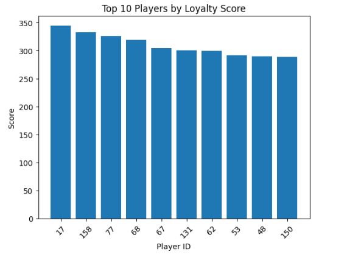
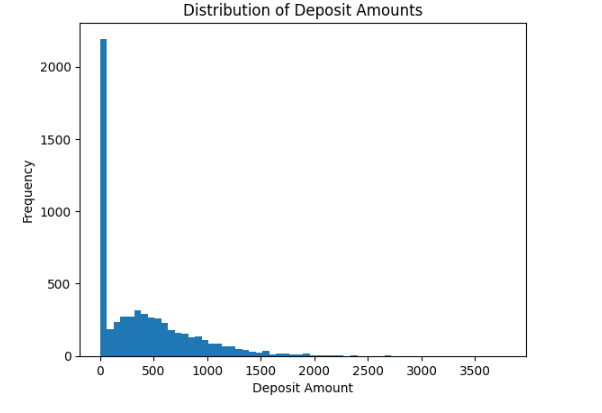
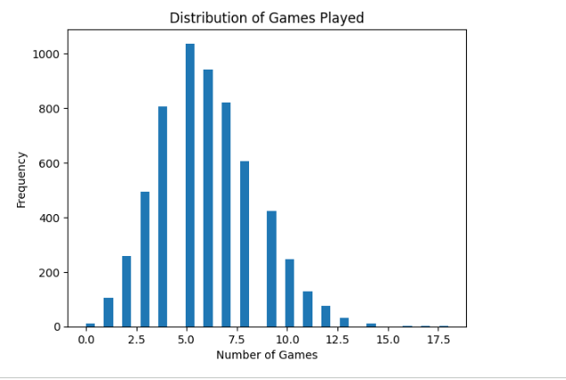
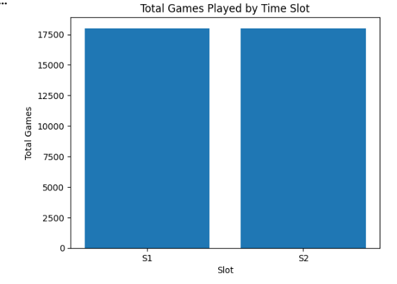
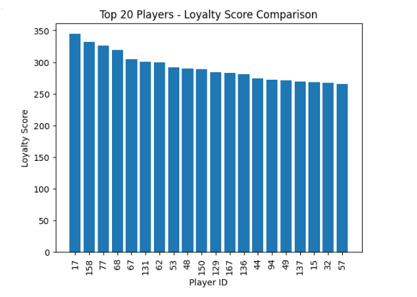
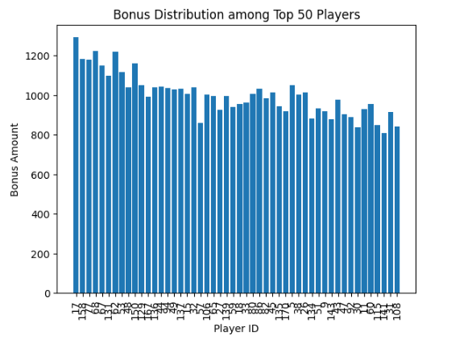
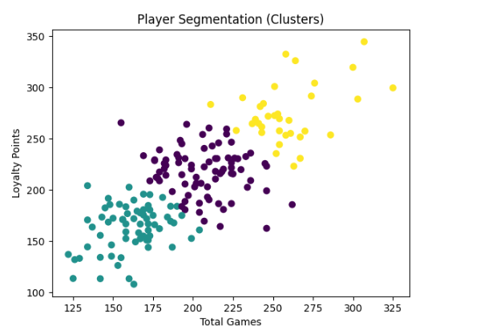
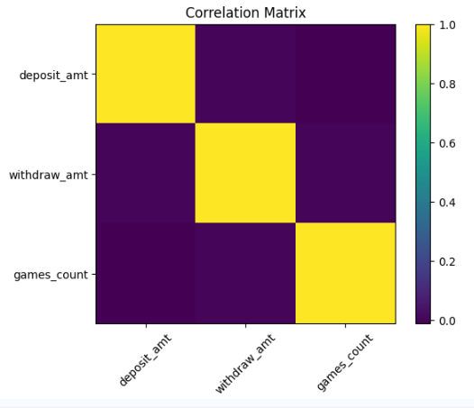
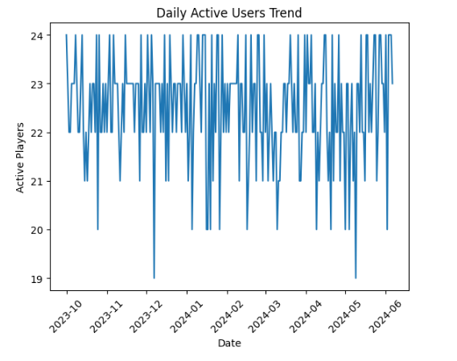
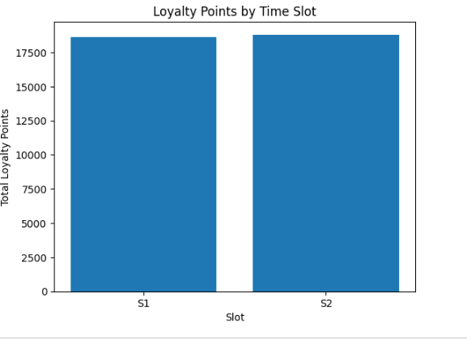

# 🎮 Gaming Loyalty Decision Science Analytics

📊 End-to-end data science & decision science project to design a fair loyalty scoring and reward system for a gaming platform.

⭐ If you found this project interesting, feel free to connect or share feedback!

---

## 📌 Overview

This project explores how data science and decision science can be combined to evaluate player behavior and design an effective loyalty and reward system for a real-money gaming platform.

The focus goes beyond analysis — it aims to answer a critical business question:

👉 *How can we fairly reward users while maximizing engagement and platform value?*

---

## 🎯 Problem Statement

Gaming platforms rely heavily on retaining active users through loyalty programs. However, poorly designed systems can:

- Over-reward high spenders  
- Ignore consistent players  
- Create skewed leaderboard dynamics  

This project builds a structured loyalty scoring system and evaluates its impact on player ranking and reward distribution.

---

## 🧠 Approach

The project follows an end-to-end analytical workflow:

- Simulated realistic player activity data (no dataset provided)  
- Feature engineering on deposits, withdrawals, and gameplay  
- Built a loyalty scoring model using weighted metrics  
- Ranked players and analyzed leaderboard behavior  
- Designed a hybrid bonus allocation strategy  
- Evaluated fairness and system limitations

Loyalty Score =
(0.01 × Deposit Amount) +
(0.005 × Withdrawal Amount) +
(0.001 × max(Deposit Count − Withdrawal Count, 0)) +
(0.2 × Number of Games Played)

---

## 📊 Key Results

- Top 10% of players contributed the majority of total loyalty points  
- Deposit-heavy users dominated leaderboard rankings  
- Gameplay activity was more evenly distributed across users  
- Hybrid reward model improved fairness across player segments  

---

## 📸 Visual Insights

### 📈 Loyalty Score Distribution

### 🏆 Leaderboard Analysis

### 🔗 Correlation Analysis

### ⏱️ Slot-wise Engagement

### 📊 Player Activity Trends

### 📉 Deposit vs Withdrawal Patterns

### 🎯 Games Played Distribution

### 🧩 Player Segmentation Visualization

### 📌 Efficiency (Points per Game)

### 📈 Monthly Performance Trends

### 🔍 Additional Insights

---

## 🧩 Player Segmentation

Players were grouped into behavioral segments:

- **Low Activity Users** → minimal engagement  
- **Moderate Users** → balanced behavior  
- **High-Value Users** → high deposits & leaderboard dominance  

📌 Enables targeted retention and reward strategies.

---

## 💰 Bonus Allocation Strategy

A hybrid model was proposed:

- 60% weight → Loyalty Score  
- 40% weight → Games Played  

✅ Balances financial contribution with engagement  
✅ Reduces dominance of high spenders  
✅ Improves fairness in reward distribution  

---

## ⚖️ Limitations

- Over-reliance on deposit amount biases results  
- Withdrawal contributing positively may hurt profitability  
- No skill-based metric (e.g., win rate) included  
- Extreme users can dominate leaderboard  

---

## 🚀 Improvements Suggested

- Use **net contribution (deposit − withdrawal)** instead of raw values  
- Introduce caps or normalization to reduce skew  
- Add behavioral metrics like consistency and retention  
- Incorporate skill-based indicators (win rate)  

---

## 📂 Project Structure

gaming-loyalty-decision-science-analytics/
│
├── Mallika_Bhardwaj_Loyalty_Analysis.ipynb
│
├── Mallika_Bhardwaj_Loyalty_Report.pdf
│
│  visual_1.png
│  visual_2.png
│  ...
│ visual_11.png
│
└── README.md
---

## 🧮 Loyalty Scoring Logic

---

## 🛠️ Tech Stack

- Python (Pandas, NumPy)  
- Data Visualization (Matplotlib, Seaborn)  
- Jupyter Notebook (Google Colab)  

---

## ▶️ How to Run

1. Open the notebook in Google Colab  
2. Run all cells  
3. Visualizations and results will be generated automatically  

---

## 📌 Conclusion

This project demonstrates how data analysis can be extended into decision-making by designing systems that balance engagement, fairness, and business impact.

A strong loyalty system is not just about rewarding users — it is about aligning incentives between users and the platform.

---

## 👩‍💻 Author

**Mallika Bhardwaj**  
Data Science & Decision Science  
